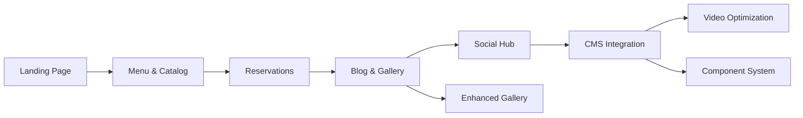

# Product Plan: Bean & Dream

> Status: approved
> Project: bean-and-dream — local specialty cafe in Dunggoan, Danao City, Philippines
> Tech Stack: Turborepo + Bun (local dev), Astro + Tailwind (frontend), Cloudflare (deployment)

## Vision

A digital hub for Bean & Dream, a local specialty cafe in Dunggoan, Danao City, Philippines. The site serves as the primary landing point for customers to discover the cafe, explore its menu (coffee beans and matcha), reserve spots for pop-up events, follow updates via blog and gallery, and connect with social accounts.

## Steering Context

- Product: Starting from scratch
- Tech Stack: Turborepo + Bun (local); Astro + Tailwind; deploy via Cloudflare Wrangler (free tier); Node APIs supported via Bun-compatible APIs; future: Sanity CMS, Cloudinary, Starwind UI
- Conventions: Conventional commits enforced by Husky; low budget; free resources preferred
- Principles: Low-cost, deployable ASAP, conventional commit/branch naming

## Personas

- **Local Cafe Visitor (Dunggoan/Danao):** Wants menu info, event updates, easy reservation.
- **Social Follower:** Follows the cafe online; needs gallery, blog, social links.

## MVP Boundary

### Must Have (Phase 1 — MVP)

- Hard-coded landing page with Astro + Tailwind.
- Static menu/catalog of coffee beans and matcha powder served.
- Reservation form for pop-up stands.
- Basic blog and event gallery (static content).
- Deployable to Cloudflare via existing Wrangler setup.

### Should Have (Phase 2 — Essentials)

- Blog section with event gallery updates.
- Enhanced reservation flow (confirmation message, basic validation).
- Social account links/integration hub.
- Responsive design refinements.

### Could Have (Phase 3 — Future)

- Dynamic CMS via Sanity.
- Video/image optimization via Cloudinary.
- Component library via Starwind UI.

### Won't Have Yet (Phase 1)

- Dynamic data backend or CMS.
- Payment processing / full e-commerce checkout.
- User accounts / authentication.
- Complex analytics or marketing automation.

## Feature Map

### Phase 1 — MVP (Hard-coded, deployable ASAP)

| ID | Feature | Module | Description |
|----|---------|--------|-------------|
| F01 | Landing Page | Main Site (Astro) | Static page: hero, cafe intro, basic info |
| F02 | Menu & Catalog | Main Site (Astro) | Static list of coffee beans, matcha powder |
| F03 | Reservations | Main Site (Astro) | Form for pop-up stand reservations |
| F04 | Blog & Gallery | Main Site (Astro) | Static posts and event image gallery |

### Phase 2 — Essentials

| ID | Feature | Module |
|----|---------|--------|
| F05 | Social Hub | Links to social accounts, embedded feeds |
| F06 | Enhanced Gallery | Expanded event photos, lightbox |

### Phase 3 — Nice to Have (Future iterations)

| ID | Feature | Module | Notes |
|----|---------|--------|-------|
| F07 | CMS Integration | Sanity | Dynamic content management |
| F08 | Video Optimization | Cloudinary | Image/video delivery |
| F09 | Component System | Starwind UI | Reusable UI components |

## Dependencies

Phase 1 (F01–F04) must be completed before Phase 2 features.

## Risks

| Risk | Impact | Mitigation |
|------|--------|------------|
| Low budget / free-tier limits | Medium | Use Cloudflare free tier, static hosting, free CMS later |
| Hard-coded content requires manual updates | Low | Phase 3 CMS (Sanity) planned; document content structure early |
| One-month timeline with ASAP delivery for landing | High | Prioritize F01 (landing) first; F02–F04 in quick follow-up within same sprint |

## Open Decisions

- Should F01 landing page include a single-page scroll layout or separate routes for F02–F04?
- Should F03 reservation form store submissions in a static file (e.g., JSON), use a free form backend (e.g., Cloudflare Workers KV / Forms), or email-only?
- Should blog/gallery content be hard-coded Markdown files in `src/content/` initially?

## Tech Constraints

- Local: Bun (not Node) for dev; code must use Bun-supported Node APIs only.
- Deploy: Cloudflare via Wrangler; Node production requires Bun-compatible APIs.
- Monorepo: Turborepo workspace; packages for `eslint`, `tsconfig`, `cloudflare`.
- Commit/branch naming: Conventional standard enforced by Husky.

## Next Step

- Confirm open decisions above.
- After approval of this plan (`plan:approved`), create `requirements.md` for F01 (Landing Page) as the first feature spec.

## Approval

> Approved by user on 2026-09-08
> Transition: plan:draft → plan:approved
