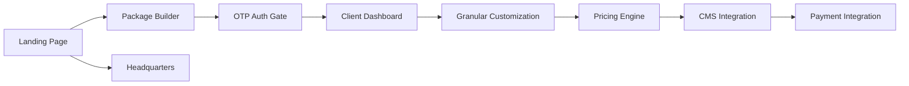

# Product Plan: Bean & Dream

> Status: In-Progress
> Project: bean-and-dream — Premium Mobile F&B Catering Service
> Tech Stack: Turborepo + Bun, Astro SSR + Tailwind CSS + Starwind UI, Cloudflare Workers, BetterAuth (OTP)

## Vision

Transition from a local cafe to a premium, scalable mobile catering provider specializing in specialty coffee, matcha, pastries, and craft drinks. The website serves as a high-conversion engine designed to capture high-value event leads through an interactive quoting experience, shifting the physical cafe to a secondary "headquarters" and tasting room.

## Steering Context

- **Product Shift:** Physical Cafe $\rightarrow$ Premium Mobile Catering Service.
- **Core Goal:** Lead generation and friction-less quoting for event planners.
- **Tech Stack:** Astro SSR (for dynamic quoting), Tailwind CSS, Starwind UI, Cloudflare Workers (Edge performance), BetterAuth (Passwordless OTP login).
- **Principles:** Low friction, high-end visual identity (Dual-Theme), conversion-oriented.

## Personas

- **Event Planner (Corporate/Wedding/Gala):** Needs a fast, transparent way to estimate costs and customize a beverage package for a specific guest count and vibe.
- **High-Net-Worth Individual:** Seeks a premium, "bespoke" experience for a private event; values aesthetics and seamless interaction.
- **Cafe Regular:** Still interested in the physical tasting room/headquarters.

## MVP Boundary

### Must Have (Phase 1 — Lead Gen Engine)

- **Dual-Theme Landing Page:** High-impact value proposition with "Ethereal Dreamscape" (Dark) and "Minimalist Alchemy" (Light) themes.
- **Interactive Package Builder:** Single-page asymmetric grid allowing users to configure guest counts, base tiers, and add-ons with a live estimate.
- **Lead Capture Gate:** BetterAuth OTP (mobile login) triggered only upon "Save & Request Availability".
- **Client Dashboard:** Simple post-auth hub to view saved quotes and a CTA to finalize via Instagram DMs.
- **Headquarters Page:** Secondary page detailing the physical tasting room.

### Should Have (Phase 2 — Experience Refinement)

- **Advanced Configuration:** More granular control over specific drink inclusions.
- **Dynamic Pricing Logic:** More complex calculations based on venue logistics or peak dates.
- **Enhanced Dashboard:** Ability to update request details before final handoff.

### Could Have (Phase 3 — Scale & Automation)

- **Direct Booking/Payment:** Integration for deposits or full booking payments.
- **CMS Integration:** Sanity for managing package tiers, pricing, and gallery updates.
- **Client Communication Hub:** Moving beyond IG DMs to integrated messaging.

### Won't Have Yet (Phase 1)

- Full e-commerce store for retail beans/matcha.
- Complex calendar availability checking.
- Multi-user organization accounts for planners.

## Feature Map

### Phase 1 — MVP (The Conversion Engine)

| ID | Feature | Module | Description |
|----|---------|--------|-------------|
| F01 | High-Conversion Landing | Main Site (Astro) | Value prop, dual-theme visuals, and "Start Building" CTA. |
| F02 | Interactive Package Builder | Main Site (Astro) | Asymmetric grid: Configuration scroll + Sticky Live Estimate ticket. |
| F03 | OTP Auth Gate | Auth (BetterAuth) | Passwordless mobile login triggered at the point of lead capture. |
| F04 | Client Lead Dashboard | Main Site (Astro) | Post-auth hub for quote review and IG DM handoff. |
| F05 | Headquarters Page | Main Site (Astro) | Details on the physical tasting room (secondary focus). |

### Phase 2 — Essentials

| ID | Feature | Module | Description |
|----|---------|--------|-------------|
| F06 | Granular Customization | Builder | Advanced add-on options and specific inclusion toggles. |
| F07 | Dynamic Pricing Engine | Builder | Logic for venue-based or date-based price adjustments. |

### Phase 3 — Nice to Have

| ID | Feature | Module | Notes |
|----|---------|--------|-------|
| F08 | CMS Integration | Sanity | Dynamic management of tiers, pricing, and content. |
| F09 | Payment Integration | Stripe/etc | Deposit and full booking payment processing. |

## Dependencies

## Risks

| Risk | Impact | Mitigation |
|------|--------|------------|
| High friction at Auth gate | Medium | Ensure OTP is truly frictionless; use clear value prop before the gate. |
| Pricing inaccuracy | Medium | Explicitly state that quotes are "Estimates" and subject to venue logistics. |
| Tech Complexity (SSR + Auth) | Medium | Use BetterAuth for streamlined OTP implementation; Astro SSR on Cloudflare. |

## Open Decisions

- **Pricing Model:** Will the "Live Estimate" be a range or a fixed calculated number?
- **BetterAuth Provider:** Which SMS/Email provider for OTP (e.g., Twilio, Resend)?
- **Handoff Path:** Is IG DM the only final channel, or should we integrate a professional contact form/email?

## Tech Constraints

- **Runtime:** Bun for local dev; Cloudflare Workers for production.
- **Frontend:** Astro SSR + Tailwind CSS + Starwind UI.
- **Auth:** BetterAuth (OTP/Passwordless).
- **Styling:** Dual-theme system (Dark: `#121212` / Light: `slate-50`).

## Next Step

- Confirm the pricing model and OTP provider.
- Once approved (`plan:approved`), create `requirements.md` for F01 (Landing Page) and F02 (Package Builder).

## Approval

> Transition: plan:approved $\rightarrow$ plan:draft (Due to Business Pivot)
