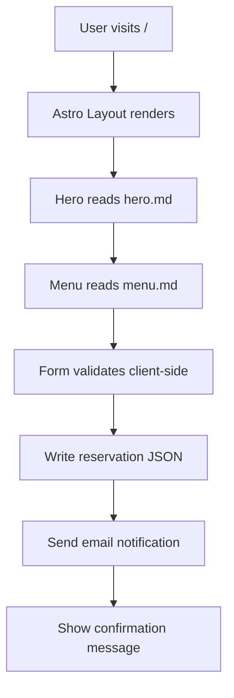

# Design: Landing Page

> Requirements: @requirements.md
> Status: Draft
> Last Updated: 2026-09-08

## 1. Executive Summary

The landing page for Bean & Dream is a static site built with Astro and Tailwind, deployed to Cloudflare via Wrangler. Content is stored as Markdown files with no dynamic backend or CMS (Phase 3 future). The reservation form stores data locally as a JSON file and triggers email notification only. The design prioritizes minimal client-side JavaScript, fast page loads, and zero deployment complexity.

## 2. Requirements Mapping

| Requirement | Design Coverage | Notes |
|-------------|-----------------|-------|
| FR-001 (Page Structure) | Section 4 — Astro layout with Tailwind responsive grid | Hero, nav, footer sections |
| FR-002 (Hero Section) | Section 4 — Hero component with static text/images | Markdown-driven content |
| FR-003 (Menu Display) | Section 4 — Menu component rendering Markdown data | Static lists |
| FR-004 (Reservation Form) | Section 4 — Form with client-side validation + static JSON write | Email trigger only |
| FR-005 (Content Sections) | Section 4 — Blog/gallery Markdown parser | Static content |
| FR-006 (Social Integration) | Section 4 — Social links component | Static links |
| FR-007 (Mobile Optimization) | Section 7 — Responsive Tailwind breakpoints | Mobile-first |
| FR-008 (SEO Basics) | Section 4 — Semantic HTML + meta tags | Static meta |
| FR-009 (Performance Monitoring) | Not applicable | No analytics in Phase 1 |
| NFR-001 (Usability) | Section 7 — Keyboard navigation, labels, WCAG 2.1 AA | Accessibility |
| NFR-002 (Performance) | Section 11 — Static build, no JS for core content | <3s load |
| NFR-003 (Accessibility) | Section 7 — Alt text, semantic HTML, contrast | AA compliance |
| NFR-004 (Security/Privacy) | Section 6 — No PII stored beyond reservation confirmation | HTTPS only |

## 3. System Architecture

### Component Overview

| Component | Responsibility | Boundaries | Notes |
|-----------|----------------|------------|-------|
| Astro Layout | Page shell, nav, footer, global styles | Root `/` | No client-side JS |
| Hero Section | Brand introduction, CTA | `/` top | Static Markdown |
| Menu Component | Coffee beans & matcha listings | `/menu` | Static Markdown |
| Reservation Form | Pop-up stand booking | `/reserve` | Client-side validation |
| Blog Preview | Recent posts snippets | `/` | Links to `/blog` |
| Blog Page | Full list of blog posts | `/blog` | Static Markdown |
| Gallery Preview | Featured event photos | `/` | Links to `/gallery` |
| Gallery Page | Full event image grid | `/gallery` | Static images |
| Social Links | Social media connections | Footer | Static links |

### Data / Control Flow



## 4. Implementation Design

### Component / Module Structure

```text
apps/main-site/
  src/
    content/
      hero.md
      menu.md
      matcha.md
      reservations/
        reservation.json
      blog/
        001-first-post.md
      gallery/
        event-1.jpg
        event-2.jpg
    layouts/
      BaseLayout.astro
      Navbar.astro
      Footer.astro
    components/
      Hero.astro
      MenuList.astro
      MatchaList.astro
      ReservationForm.astro
      BlogPreview.astro
      GalleryGrid.astro
      SocialLinks.astro
    styles/
      tailwind.config.js
      globals.css
  public/
    favicon.ico
```

### Core Interfaces

```ts
// ReservationForm submission contract
interface ReservationSubmission {
  name: string;
  email: string;
  phone: string;
  eventDate: string;
  submittedAt: string;
}

// Menu item contract
interface MenuItem {
  name: string;
  description: string;
  price?: string;
  category: 'coffee' | 'matcha';
}
```

### Data Model / State

**Not applicable.** Static content stored in Markdown files. No client-side state management or backend databases. Reservation data stored locally as `reservation.json`.

### API / Integration Contract

| Method / Event | Path / Topic | Purpose | Request | Response / Result |
|----------------|--------------|---------|---------|-------------------|
| POST | `/reserve` (client-side) | Submit reservation | `ReservationSubmission` | `{ success: boolean; message: string }` |
| GET | `/content/hero` | Read hero content | N/A | Markdown content |
| GET | `/content/menu` | Read menu content | N/A | Markdown content |

**Note:** No server-side API endpoints — form writes to local JSON and sends email via Cloudflare Forms or email service.

## 5. Integration Points

| System | Purpose | Auth / Permissions | Failure Handling |
|--------|---------|--------------------|------------------|
| Cloudflare Wrangler | Deployment & hosting | Wrangler CLI auth | Deploy fails → re-run `wrangler deploy` |
| Email service | Reservation notifications | SMTP/API key | Failed send → log error, show user message |
| Cloudflare Forms | Form submission (optional) | Free tier | Fallback to JSON-only storage |

## 6. Security / Permissions / Privacy

- **Authentication:** Not applicable (public-facing site)
- **Authorization:** Not applicable (no user accounts)
- **Input validation:** Client-side only (name, email, phone, date); server-side via Cloudflare Forms if used
- **Sensitive data:** Only name, email, phone collected; no storage beyond immediate confirmation; HTTPS enforced
- **Abuse cases:** Rate-limiting via Cloudflare; reservation form subject to spam protection

## 7. UX / Accessibility

- **Keyboard behavior:** All interactive elements (nav links, form fields, buttons) keyboard-navigable
- **Screen reader/semantic requirements:** Semantic HTML (`<header>`, `<nav>`, `<main>`, `<section>`, `<footer>`); alt text on all images; ARIA labels on interactive elements
- **Responsive behavior:** Mobile-first Tailwind breakpoints (`sm:`, `md:`, `lg:`); hamburger menu on mobile
- **Loading/empty/error states:** Loading state via CSS skeleton; empty state for blog/gallery with placeholder text; error state for form submission failure

## 8. Edge Cases

| Case | Expected Behavior |
|------|-------------------|
| Missing content (Markdown file not found) | Show placeholder text ("Coming soon") |
| Form validation fails | Show inline error messages, prevent submission |
| Email service unavailable | Show "Reservation received" message, log failure internally |
| Image not loaded | Show alt text placeholder |
| Slow network | Static content renders immediately; form submission may be delayed |

## 9. Impact Analysis

| Component | Impact Type | Description and Risk | Required Action |
|-----------|-------------|----------------------|-----------------|
| `apps/main-site/src/` | new | New Astro project structure | Create from scratch |
| `apps/main-site/src/content/` | new | Static content directory | Create Markdown files |
| `apps/main-site/src/components/` | new | Astro components | Create component files |
| `apps/main-site/tailwind.config.js` | new | Tailwind configuration | Create config |
| `apps/main-site/public/` | new | Static assets | Create directory |

## 10. Development Sequencing

1. **Project scaffold** — Astro + Tailwind + Turborepo setup (no dependencies)
2. **Layout & navigation** — Base layout, navbar, footer (depends on step 1)
3. **Hero section** — Static content from Markdown (depends on step 2)
4. **Menu component** — Coffee & matcha listings from Markdown (depends on step 3)
5. **Reservation form** — Form validation + JSON write (depends on step 4)
6. **Blog & gallery** — Content sections (depends on step 5)
7. **Social links & footer** — Integration (depends on step 6)
8. **Deployment** — Cloudflare Wrangler deploy (depends on step 7)

## 11. Testing / Verification Strategy

### Unit / Component

- [ ] Astro components render without errors
- [ ] Menu data loads from Markdown correctly
- [ ] Form validation accepts valid input, rejects invalid input

### Integration / API

- [ ] Reservation form writes to `reservation.json`
- [ ] Email notification triggered on form submission

### E2E / Manual

- [ ] Page loads within 3 seconds on 4G
- [ ] Mobile navigation works (hamburger menu)
- [ ] Form submission shows confirmation message
- [ ] All links (social, internal) work correctly

### Project Verification

- Lint: `bun run lint`
- Typecheck: `bun run typecheck`
- Build: `bun run build`
- Deploy preview: `bun run dev` (local) + `wrangler deploy` (production)

## 12. Observability / Operations

- **Logs:** N/A — no server-side logging for Phase 1
- **Metrics:** N/A — no analytics in Phase 1
- **Analytics:** N/A — deferred to Phase 3 (future)
- **Alerts:** N/A — deployment errors visible via Wrangler CLI
- **Support/debugging:** Wrangler CLI logs; browser DevTools for client-side issues

## 13. Migration / Rollout

- **Migration:** Not applicable — greenfield project, no existing data to migrate
- **Feature flag:** Not applicable — static site, all features visible immediately
- **Rollout:** Single deployment to Cloudflare via `wrangler deploy`
- **Rollback:** Redeploy previous version via `wrangler deploy --previous`

## 14. Technical Decisions

### TD-001: Static Site Architecture

- **Decision:** Use Astro with zero client-side JavaScript for core content
- **Why:** Astro ships HTML-only by default; no JS required for static content; aligns with performance NFR
- **Trade-off:** No interactive features without adding islands of interactivity
- **Alternatives considered:** Next.js (JS-heavy), SvelteKit (complexity), vanilla HTML (no build tooling)

### TD-002: Markdown-based Content

- **Decision:** Store all content in Markdown files under `src/content/`
- **Why:** Simplest content management for Phase 1; café owner can edit directly; zero infrastructure
- **Trade-off:** Manual content updates; no CMS interface
- **Alternatives considered:** JSON files (less readable), headless CMS (too complex for Phase 1)

### TD-003: Cloudflare Wrangler Deployment

- **Decision:** Deploy via existing Wrangler configuration
- **Why:** Free tier; already configured in monorepo; aligns with low-budget constraint
- **Trade-off:** Limited to Cloudflare ecosystem features
- **Alternatives considered:** Vercel (cost), Netlify (cost), GitHub Pages (limited)

### TD-004: Bun for Local Development

- **Decision:** Use Bun runtime for local dev and build
- **Why:** Consistent with monorepo setup; faster startup than Node
- **Trade-off:** Must use Bun-compatible Node APIs; Node production via Bun layer
- **Alternatives considered:** Node directly (slower dev), npx (adds complexity)

## 15. Known Risks

| Risk | Likelihood | Impact | Mitigation |
|------|------------|--------|------------|
| Markdown file content errors break build | Medium | High | Validate Markdown on commit via Husky pre-commit hook |
| Reservation form email delivery fails silently | Low | Medium | Log failures; use Cloudflare Forms as fallback |
| Bun/Node API incompatibility | Medium | Medium | Test with both Bun and Node; use Bun-compatible APIs only |
| Cloudflare Wrangler deployment issues | Low | High | Keep `wrangler.toml` backed up; use `wrangler deploy --dry-run` |
| Design does not match café branding | Medium | Medium | Share mockup with café owner before development |

## 16. Implementation FAQ

**Q: How do I add a new blog post?**  
A: Create a new Markdown file in `src/content/blog/` with frontmatter title and date.

**Q: How do I update the menu?**  
A: Edit `src/content/menu.md` — Astro reads it on build. No rebuild needed if using Wrangler's static hosting.

**Q: Can I add images to the gallery?**  
A: Place images in `src/content/gallery/` and reference them in the gallery component.

**Q: Does the reservation form persist data?**  
A: Only locally as `reservation.json`; no backend database. For Phase 1 this is sufficient.

**Q: How do I test locally before deploying?**  
A: Run `bun run dev` in the main-site package. Preview at `http://localhost:4321`.

## 17. Open Questions

- Exact color palette and typography for the landing page (to be confirmed with café owner)
- Whether to include a contact page or keep all info on the landing page
- Number of blog posts to pre-populate for initial launch
- Preferred image dimensions and formats for gallery
