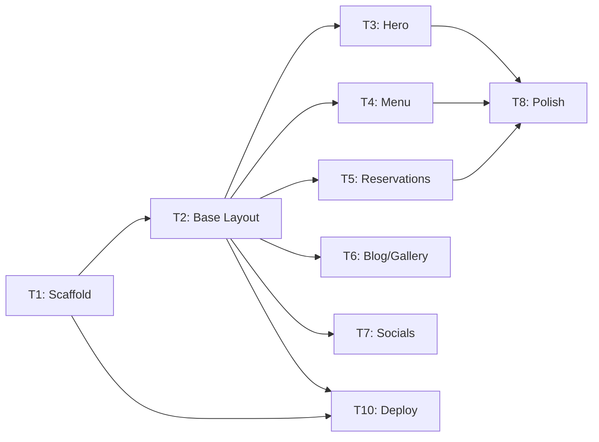

# Tasks: Landing Page

> Requirements: @requirements.md
> Design: @design.md
> Status: Approved
> Last Updated: 2026-09-08

## Requirement Coverage

| Requirement | Tasks | Notes |
|-------------|-------|-------|
| FR-001 | T1, T2 | Base layout and structural routing |
| FR-002 | T3 | Hero component and content |
| FR-003 | T4 | Menu component and Markdown data |
| FR-004 | T5 | Reservation form, validation, and JSON write |
| FR-005 | T6 | Blog and gallery sections |
| FR-006 | T7 | Social links integration |
| FR-007 | T2, T8 | Tailwind responsive breakpoints |
| FR-008 | T2 | SEO meta tags in BaseLayout |
| NFR-001 | T2, T8 | Semantic HTML and keyboard navigation |
| NFR-002 | T1, T10 | Static build and asset optimization |
| NFR-003 | T8 | Alt text and accessibility audit |
| NFR-004 | T5 | HTTPS and PII handling |

## Design Coverage Check

| Requirement | Design Coverage | Status | Notes |
|-------------|-----------------|--------|-------|
| FR-001 | Design Section 4 / TD-001 | Pass | Covered by Astro Layout |
| FR-004 | Design Section 4 / TD-002 | Pass | Covered by Reservation Form design |
| NFR-002 | Design Section 11 / TD-001 | Pass | Covered by static generation strategy |

## Implementation Readiness Check

| Check | Status | Notes |
|-------|--------|-------|
| Must Have requirements have tasks | Pass | All FRs covered |
| Tasks map to requirements/design | Pass | Directly mapped |
| Critical Questions answered | Pass | Q-001, Q-002, Q-003 all answered |
| Tasks have dependencies/AC/files | Pass | Detailed in task definitions |
| Verification commands identified | Pass | Bun/Wrangler commands included |
| No blocking gaps remain | Pass | Ready for implementation |

## Implementation Slices

### MVP Slice: Core Landing Page
- **Goal:** Deploy a responsive landing page with basic info and menu to Cloudflare.
- **User Stories:** US-001, US-002
- **Tasks:** T1, T2, T3, T4
- **Independent validation:** Root URL loads, hero and menu are visible on mobile/desktop.

### User Story US-003 Slice: Reservations
- **Goal:** Functional reservation form with local storage and email trigger.
- **Tasks:** T5
- **Independent validation:** Form submission writes to JSON and sends email notification.

### User Story US-004 Slice: Content Engagement
- **Goal:** Static blog and gallery sections with social links.
- **Tasks:** T6, T7
- **Independent validation:** Blog posts and gallery images render; social links redirect correctly.

## Task Summary

| Task | Title | Priority | Estimate | Dependencies | Status |
|------|-------|----------|----------|--------------|--------|
| T1 | Project Scaffold | P0 | 2h | none | pending |
| T2 | Base Layout & SEO | P0 | 2h | T1 | completed |
| T3 | Hero Section | P0 | 1h | T2 | completed |
| T4 | Menu Component | P0 | 2h | T2 | pending |
| T5 | Reservation Form | P0 | 4h | T2 | pending |
| T6 | Blog & Gallery Sections | P1 | 2h | T2 | pending |
| T7 | Social Links Integration | P1 | 1h | T2 | pending |
| T8 | Accessibility & Mobile Polish | P1 | 2h | T3, T4, T5 | pending |
| T9 | Final Content Populate | P2 | 1h | T3, T4, T6 | pending |
| T10 | Cloudflare Deployment | P0 | 1h | T1, T2 | pending |

## Dependency Diagram

## Task T1: Project Scaffold

**Priority:** P0  
**Estimate:** 2h  
**Dependencies:** none  
**Covers:** NFR-002  
**Status:** pending

### Overview
Initialize the Turborepo workspace with an Astro app and Tailwind CSS. Setup Bun as the primary runtime.

### Work
- [ ] Create Astro project in `apps/main-site`
- [ ] Install and configure Tailwind CSS
- [ ] Setup Bun-based scripts in `package.json`
- [ ] Configure Turborepo pipeline for build/lint

### Acceptance Criteria
- [ ] `bun run dev` starts the Astro dev server
- [ ] Tailwind styles apply correctly to a test page
- [ ] `bun run build` completes without errors

### Files
- `apps/main-site/package.json` — create
- `apps/main-site/astro.config.mjs` — create
- `apps/main-site/tailwind.config.cjs` — create

### Verification
- [ ] Build passes: `bun run build`
- [ ] Lint passes: `bun run lint`

---

## Task T2: Base Layout & SEO

**Priority:** P0  
**Estimate:** 2h  
**Dependencies:** T1  
**Covers:** FR-001, FR-007, FR-008, NFR-001, NFR-003  
**Status:** pending

### Overview
Implement the global page shell, including the Navbar, Footer, and SEO meta tags to ensure a consistent look and feel across the site.

### Work
- [ ] Create `BaseLayout.astro` with standard HTML5 structure
- [ ] Implement responsive `Navbar.astro` with hamburger menu
- [ ] Implement `Footer.astro` with café copyright and basic links
- [ ] Add dynamic meta tags for title, description, and OpenGraph

### Acceptance Criteria
- [ ] Navbar is sticky and responsive
- [ ] Footer is present on all pages
- [ ] SEO tags are correctly rendered in the `<head>`

### Files
- `apps/main-site/src/layouts/BaseLayout.astro` — create
- `apps/main-site/src/components/Navbar.astro` — create
- `apps/main-site/src/components/Footer.astro` — create

### Verification
- [ ] Manual: Inspect head for meta tags
- [ ] Manual: Test hamburger menu on mobile viewport

---

## Task T3: Hero Section

**Priority:** P0  
**Estimate:** 1h  
**Dependencies:** T2  
**Covers:** FR-002  
**Status:** pending

### Overview
Create the high-impact hero section that introduces Bean & Dream, utilizing Markdown for the tagline and CTA text.

### Work
- [ ] Create `Hero.astro` component
- [ ] Set up `src/content/hero.md` for content
- [ ] Implement responsive layout with background image/color
- [ ] Link CTA button to the menu section

### Acceptance Criteria
- [ ] Hero text renders from Markdown
- [ ] CTA button redirects to the menu section
- [ ] Layout is visually compelling on both mobile and desktop

### Files
- `apps/main-site/src/components/Hero.astro` — create
- `apps/main-site/src/content/hero.md` — create

### Verification
- [ ] Manual: Verify content updates in `hero.md` reflect on page

---

## Task T4: Menu Component

**Priority:** P0  
**Estimate:** 2h  
**Dependencies:** T2  
**Covers:** FR-003  
**Status:** pending

### Overview
Implement the Menu and Catalog section, rendering static listings of coffee beans and matcha powder from Markdown files.

### Work
- [ ] Create `MenuList.astro` and `MatchaList.astro` components
- [ ] Set up `src/content/menu.md` and `src/content/matcha.md`
- [ ] Design clean, responsive grids for items and descriptions
- [ ] Implement "category" filtering if applicable

### Acceptance Criteria
- [ ] Coffee and Matcha items render correctly from Markdown
- [ ] Layout is readable and professional
- [ ] Descriptions and pricing are clearly visible

### Files
- `apps/main-site/src/components/MenuList.astro` — create
- `apps/main-site/src/components/MatchaList.astro` — create
- `apps/main-site/src/content/menu.md` — create
- `apps/main-site/src/content/matcha.md` — create

### Verification
- [ ] Manual: Verify all menu items from Markdown are displayed

---

## Task T5: Reservation Form

**Priority:** P0  
**Estimate:** 4h  
**Dependencies:** T2  
**Covers:** FR-004, NFR-004  
**Status:** pending

### Overview
Build the pop-up stand reservation form with client-side validation, local JSON storage, and email notification triggers.

### Work
- [ ] Create `ReservationForm.astro` component
- [ ] Implement client-side validation for name, email, and phone
- [ ] Implement submission logic to write to `src/content/reservations/reservation.json`
- [ ] Integrate email notification (via Cloudflare Forms or chosen service)
- [ ] Implement success/error confirmation messages

### Acceptance Criteria
- [ ] Form prevents submission of invalid data
- [ ] Valid submissions create an entry in `reservation.json`
- [ ] User receives immediate confirmation on screen
- [ ] Email notification is successfully triggered

### Files
- `apps/main-site/src/components/ReservationForm.astro` — create
- `apps/main-site/src/content/reservations/reservation.json` — create

### Verification
- [ ] Manual: Submit form and verify `reservation.json` entry
- [ ] Manual: Check email inbox for notification

---

## Task T6: Blog & Gallery Sections

**Priority:** P1  
**Estimate:** 2h  
**Dependencies:** T2  
**Covers:** FR-005  
**Status:** pending

### Overview
Implement the static blog and event gallery systems, consisting of preview sections on the landing page and dedicated full-page routes.

### Work
- [ ] Create `BlogPreview.astro` and `GalleryGrid.astro` for the landing page
- [ ] Create dedicated `/blog` and `/gallery` pages using Astro routes
- [ ] Setup `src/content/blog/` for posts and `src/content/gallery/` for images
- [ ] Implement "View All" links on the landing page leading to the full routes
- [ ] Implement a simple grid layout for the gallery and a list layout for the blog

### Acceptance Criteria
- [ ] Landing page shows a limited set of recent posts/images
- [ ] Clicking "View All" redirects to the correct full page
- [ ] Full pages render all content from the designated content directories

### Files
- `apps/main-site/src/pages/blog.astro` — create
- `apps/main-site/src/pages/gallery.astro` — create
- `apps/main-site/src/components/BlogPreview.astro` — create
- `apps/main-site/src/components/GalleryGrid.astro` — create
- `apps/main-site/src/content/blog/` — create directory
- `apps/main-site/src/content/gallery/` — create directory

### Verification
- [ ] Manual: Add new image/post and verify it appears on the landing page

---

## Task T7: Social Links Integration

**Priority:** P1  
**Estimate:** 1h  
**Dependencies:** T2  
**Covers:** FR-006  
**Status:** pending

### Overview
Add a dedicated social links component to the footer and/or a separate section to enable easy connection to café accounts.

### Work
- [ ] Create `SocialLinks.astro` component
- [ ] Implement icons for Instagram, Facebook, and other platforms
- [ ] Configure links to open in new tabs (`target="_blank"`)

### Acceptance Criteria
- [ ] All social links redirect to correct profiles
- [ ] Icons are visually consistent with branding

### Files
- `apps/main-site/src/components/SocialLinks.astro` — create

### Verification
- [ ] Manual: Click every social link to verify destination

---

## Task T8: Accessibility & Mobile Polish

**Priority:** P1  
**Estimate:** 2h  
**Dependencies:** T3, T4, T5  
**Covers:** FR-007, NFR-001, NFR-003  
**Status:** pending

### Overview
Perform a final polish pass focusing on accessibility (WCAG 2.1 AA) and responsive refinements across all components.

### Work
- [ ] Audit contrast ratios for all text and buttons
- [ ] Add alt text to all images and ARIA labels to interactive elements
- [ ] Refine Tailwind breakpoints for edge-case mobile devices
- [ ] Test keyboard navigation flow across the entire page

### Acceptance Criteria
- [ ] Contrast ratios meet 4.5:1 minimum
- [ ] No "tab traps" during keyboard navigation
- [ ] Layout is flawless on screens from 320px to 2560px

### Verification
- [ ] Manual: Use Lighthouse or WAVE for accessibility audit
- [ ] Manual: Tab through the whole page to verify focus states

---

## Task T10: Cloudflare Deployment

**Priority:** P0  
**Estimate:** 1h  
**Dependencies:** T1, T2  
**Covers:** NFR-002  
**Status:** pending

### Overview
Deploy the static build to Cloudflare Pages using Wrangler to make the site live.

### Work
- [ ] Finalize `wrangler.toml` configuration
- [ ] Execute `bun run build` to generate static assets
- [ ] Run `wrangler deploy` to push to production
- [ ] Verify production URL accessibility

### Acceptance Criteria
- [ ] Site is accessible via the provided Cloudflare URL
- [ ] Production build matches local dev behavior
- [ ] HTTPS is automatically enabled by Cloudflare

### Files
- `apps/main-site/wrangler.toml` — create/modify

### Verification
- [ ] Manual: Load production URL on mobile and desktop
- [ ] Command: `wrangler deploy` exits with success
